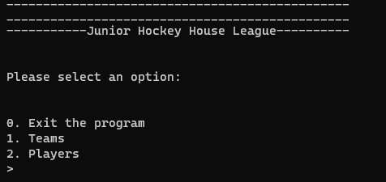
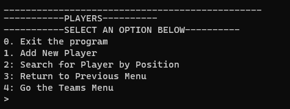

# Phase 3 CLI + ORM Project 

## Junior Hockey House League Roster

## Description
This is a command line interface (CLI) application to explore the relationship between hockey teams and their players. It represents a one-to-many relationship between the teams and their players.

## File Structure and Contents

Take a look at the directory structure:

```
├── Pipfile
├── Pipfile.lock
├── README.md
└── lib
    ├── models
    │   ├── __init__.py
    │   ├── player.py
    |   └── team.py
    ├── cli.py
    ├── debug.py
    └── helpers.py
```

## CLI Menu Options

Main Menu

Teams Menu

Players Menu


## Generating Your Environment

You might have noticed in the file structure- there's already a Pipfile!

Install any additional dependencies you know you'll need for your project by
adding them to the `Pipfile`. Then run the commands:

```console
pipenv install
pipenv shell
```

---


## Conclusion

A lot of work goes into a good CLI, but it all relies on concepts that you've
practiced quite a bit by now. Hopefully this template and guide will get you off
to a good start with your Phase 3 Project.

Happy coding!

---

## Resources

- [Markdown Cheat Sheet](https://www.markdownguide.org/cheat-sheet/)
