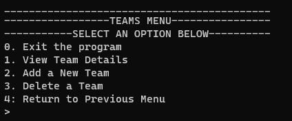

# Phase 3 CLI + ORM Project 

## Junior Hockey House League Roster

## Description
This is a command line interface (CLI) application that allows a user to manage the team and players within a junior hockey house league.

You can run the file `cli.py` to start up the CLI.

## Demo

Link to a video demonstrating the functionality.

## File Structure and Contents

Take a look at the directory structure:

```
├── Pipfile
├── Pipfile.lock
├── README.md
└── lib
    ├── models
    │   ├── __init__.py
    │   ├── player.py
    |   └── team.py
    ├── cli.py
    ├── debug.py
    └── helpers.py
```

## CLI Menu Options

### Main Menu


From the Main Menu, you can choose either choose the Team or Players menu.

### Teams Menu


From the Teams Menu, if you select 'View Team Details', you can select a Team to view the team details and roster. From there, you can add, delete or update players, or update the team. From the Teams Menu, you can also add or delete Teams, which will also delete any players on that team.

### Players Menu


From the Players Menu, you can add a new player to any team and search for players by their position.

## Helper Functions

`exit_program()` exists the program from all menus when you select '0'.

`list_teams()` shows all the players in the league

`add_team()` lets you add a new team to the database.

`view_team()` shows the details of a specific team, including the team name, color and mascot, as well as the roster.

`update_team()` allows the user to update the name, color or mascot of the team.

`delete_team()` deletes a team from the database.

`view_roster()` shows all of the players on a specific team.

`list_players()` shows all of the players in the league.

`add_player()` lets the user add a new player to the selected team. This can be accessed from the selected team menu or the players menu.

`update_player()` lets the user update a player from the selected team. This can be accessed from the selected team menu or the players menu.

`delete_player()` lets the user delete a player from the selected team.

`find_player_by_position()` lets the user search for players by their position and returns a list of all players in that position from all teams.


